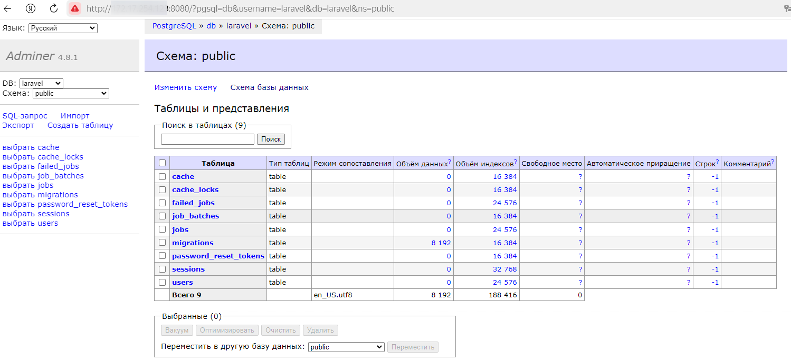
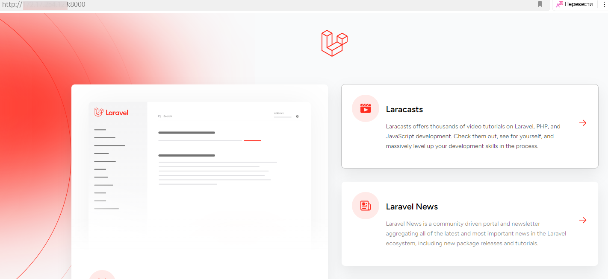
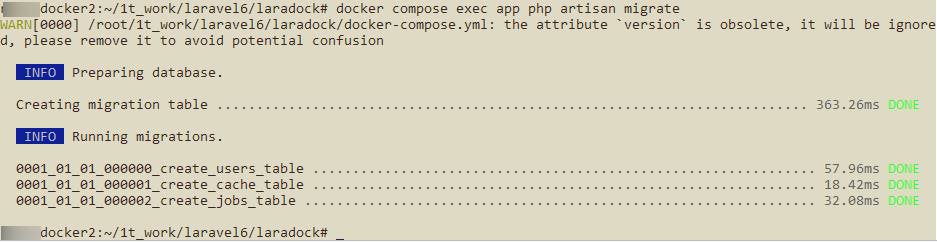
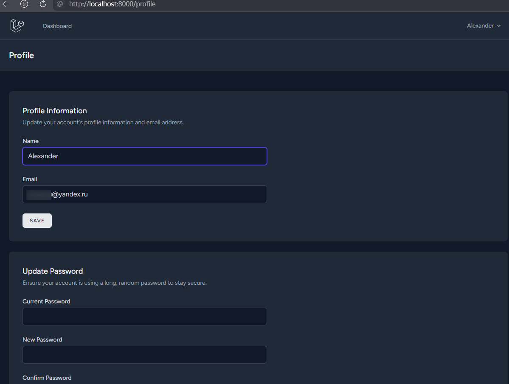
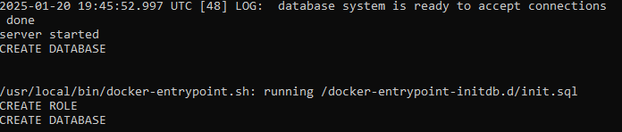
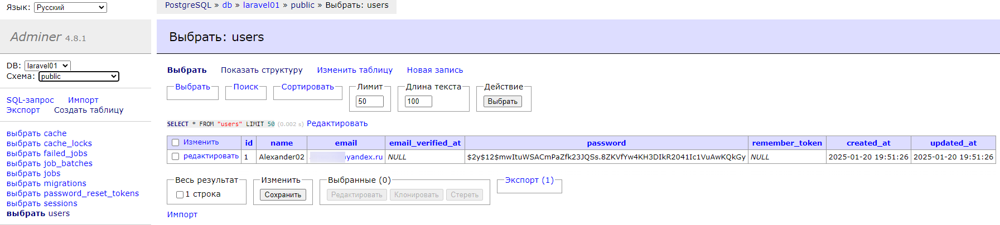
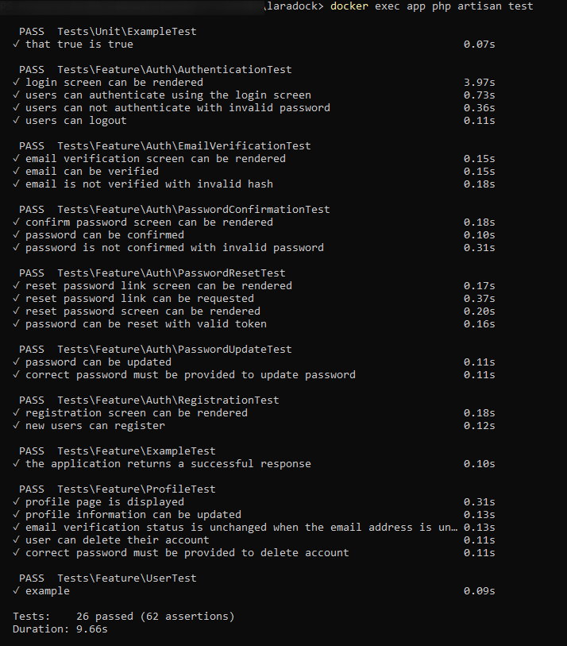

# Создание docker-compose под laravel + PostgreSQL + adminer

## Требования к заданию:

Контейнер с Laravel (https://laravel.com/docs/11.x) приложением:

* Создать Dockerfile для Laravel приложения,
  
  * Включить необходимые зависимости и настройки для запуска Laravel,
  * внутри контейнера должны быть nginx, php-fpm (8.2+), laravel 11.x
* Контейнер PostgreSQL:
  
  * Поднять контейнер с PostgreSQL 16
  * Настроить базу данных, должна быть создана база данных с произвольным именем и пользователем
  * с произвольным именем и парольным доступом к бд (он должен быть без привилегий суперпользователя, должен видеть только свою базу данных и уметь читать и писать в нее).
* Контейнер adminer:
  
  * Поднять контейнер с adminer.
  * Из веб дашборда adminer (должен быть доступен из браузера по произвольному порту), должна быть возможность подключаться к базе данных
* Запуск приложения:
  
  * Приложение должно быть доступно на порту 8080.
  * Должны работать миграции, тесты и авторизация/регистрация (используем встроенные в laravel)
  * Важно, что все необходимые зависимости должны устанавливаться внутри контейнеров, и проект должен быть работоспособным после старта контейнеров.
* Результат:
  
  * Ссылка на исходный код, который должен быть размещен в любом публичном vcs например https://github.com/.

# Реализация

* Подключение к БД через adminer
  
* Главная страница Laravel
  
* Миграция Laravel
  
* Профиль пользователя
  
* Отдельный пользователь для Laravel
  
* Регистрация пользователя в Laravel
  
* Тесты в Laravel
  

